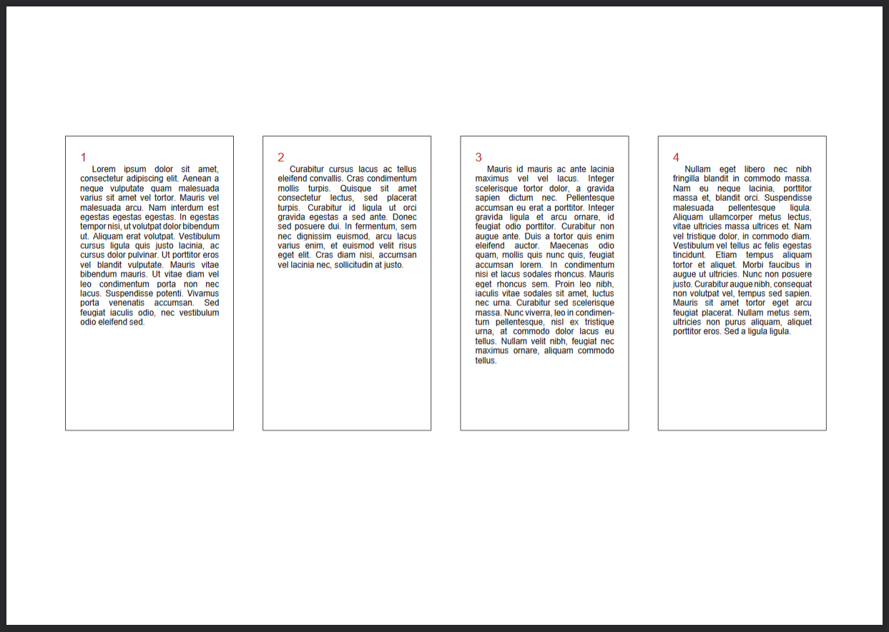
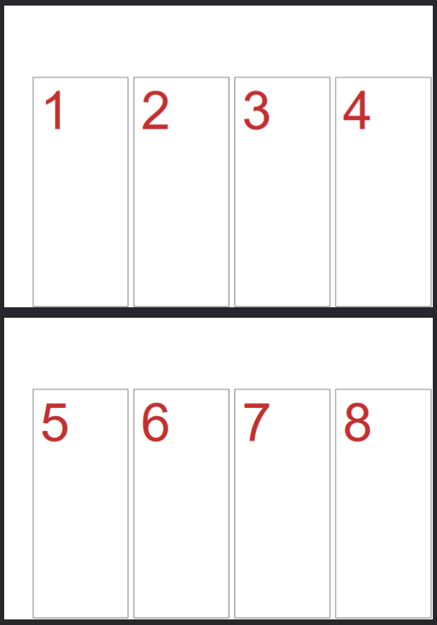
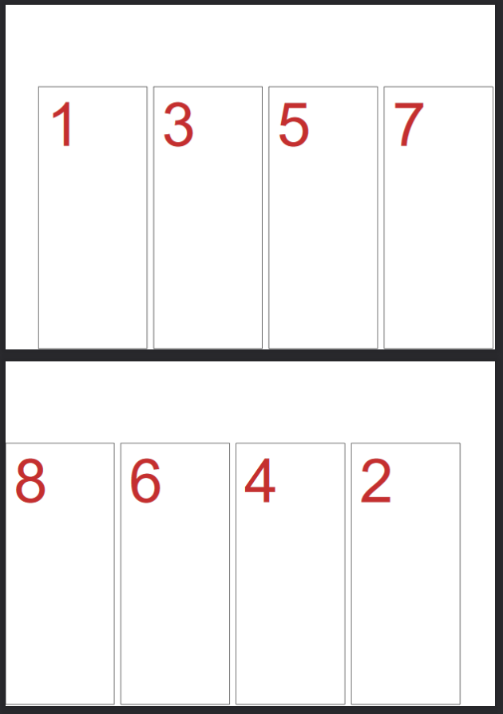

# jsPDF-Context-plugin
Plugin to make custom context with jsPDF.



Contexts are areas in which you can set properties (TextColor, DrawColor, Font, FontSize...) separately or with inheritance.
	
## Usage
You need to include jsPDF before context.
```html
<script src="./script/jspdf.min.js"></script>
<script src="./script/jspdf.plugin.context.min.js"></script>
```
	
## Methods

* [registerContextableFunction](#registercontextablefunction-name-string-model-numbernull--boolean)
* [registerContextableState](#registercontextablestate-name-string-setters-objectundefined--undefined)
* [contextGenerators](#contextgenerators)
* [createContext](#createcontext-x-number-y-number-pageoffset-number-options-object--object)
* [createContextFromGenerator](#createcontextfromgenerator-generator-functionid-pageoffset-number--object)
---

### registerContextableFunction (name: string, model: (number|null)[]) → boolean
Adds a function that can be called from a context.
| Name | Type | Description |
| --------------- | --------------- | --------------- |
| name | string | Name of the function to call from the jsPDF instance (jsPDF.\<Name\>()). |
| model | (number\|null)[] | An array of null where x/y coordinates arguments of the \<Name\> function are replaced by 1. For exemple: jsPDF.\<Name\>(x1, y2, x1, y2) → [1,1] ; jsPDF.\<Name\>(text, x, y) → [,1] |
| *→result* | boolean | true if the function was added. false if name already exist. |
```js
\\ register jsPDF.drawClouds(type, x, y, options)
doc.registerContextableFunction('drawClouds', [,1])
```
---


### registerContextableState (name: string, setters: object|undefined) → undefined
Adds a state that can be saved and applied from a context.
| Name | Type | Description |
| --------------- | --------------- | --------------- |
| name | string | Name of the function used to set and get without get and set. For exemple: jsPDF.setTintColor()/jsPDF.getTintColor() → TintColor |
| model | object\|undefined | undefined if the result of set\<Name\>() is the same of argument of get\<Name\>(). Else, you need to give setter or getter {set: function, get: function} |
```js
\\ register jsPDF.setTintColor(color) \ color = jsPDF.getTintColor();
doc.registerContextableState('TintColor')

\\ register jsPDF.setFont(fontName, fontStyle, fontWeight) \ {fontName, fontStyle, fontWeight} = jsPDF.getFont();
doc.registerContextableState('Font', {
	set: (obj) => ([obj.fontName,obj.fontStyle,obj.fontWeight]),
	get: (arr) => ({fontName:arr[0],fontStyle:arr[1],fontWeight:arr[2]})
}
```
---


### contextGenerators
List of predefined context generators

#### contextGenerator.columns (number: number; options: object) → function(id: number)
Generator to create columns



| Name | Type | Description |
| --------------- | --------------- | --------------- |
| number | number | The number of columns by page side |
| options | object | {offsetLeft, offsetTop, offsetPage, margin, padding, height, width} |
| *→result* | function(id) | Generator to pass to createContextFromGenerator. |
```js
doc.contextGenerators.columns(5, {
  margin: 10
}
```

#### contextGenerator.accordions (number: number, options: object) → function(id: number)
Generator to create alternated columns for double-sided printing 

| Name | Type | Description |
| --------------- | --------------- | --------------- |
| number | number | The number of columns by page side |
| options | object | {offsetLeft, offsetTop, offsetPage, margin, padding, height, width} |
| *→result* | function(id) | Generator to pass to createContextFromGenerator. |
```js
doc.contextGenerators.accordions(5, {
  margin: 10,
  offsetTop: 30
}
```
---


### createContext (x: number, y: number, pageOffset: number, options: object) → object
Create a simple context
| Name | Type | Description |
| --------------- | --------------- | --------------- |
| x | number | Left offset of the context |
| y | number | Top offset of the context |
| pageOffset | number | Page offset of the context from the first page (or parent context page) |
| options | object | {height, width} |
| *→result* | object | Simple context object with context methods : {level, pdfContext, parentContext, firstLevelContext, pageNumber, contextLeft, contextTop, contextWidth, contextHeight, contextRight, contextBottom, setFont, setTextColor, text, line, ...} |
```js
const context = doc.createContext(10, 10, 0, {
  width: 100,
  height: 50
});
doc.setDrawColor('#FF0000'); // red for doc context
context.line(0, 0, context.contextWidth(), context.contextHeight()); // red (inherited) line with a top and a left offset of 10
context.setDrawColor('#000000'); // black for this context
doc.line(0, 0, context.contextWidth(), context.contextHeight()); // red line to the top and left of the document
context.line(10, 10, context.contextWidth(), context.contextHeight()); // black line with a top and a left offset of 20
```
---


### createContextFromGenerator (generator: function(id), pageOffset: number) → object
Create a group of contexts from a context generator
| Name | Type | Description |
| --------------- | --------------- | --------------- |
| generator | function(id) | Generator function which return context informations from id |
| *→result* | object | Context from generator object with simple context methods and : {first, get}. First and get return a context with simple context with : {first, next, previous, contextId, custom, createContext} |
```js
const contexts = doc.createContextFromGenerator(doc.contextGenerators.accordions(5));
for(let context = contexts.first() /* or contexts.get(1) */; context.contextId() < 10; context = context.next()) {
  context.line(0, 0, 50, 100);
}
```
